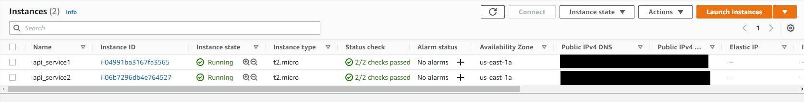
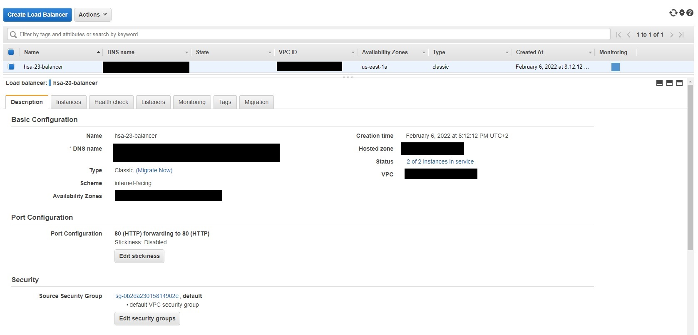
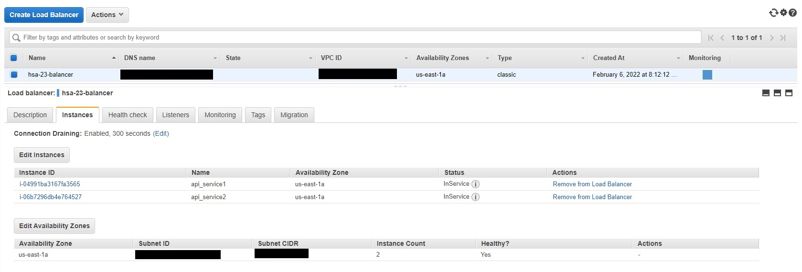
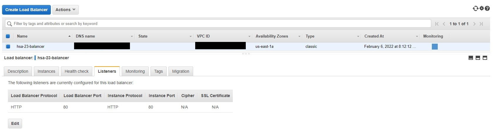
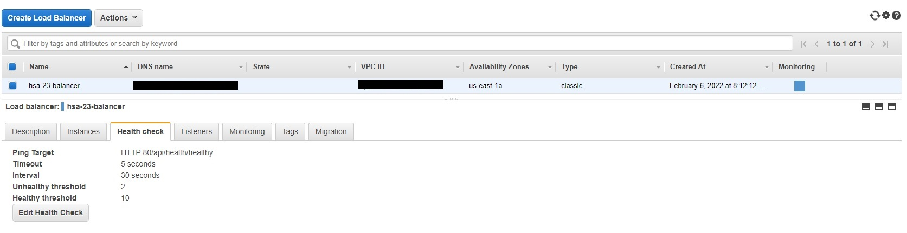
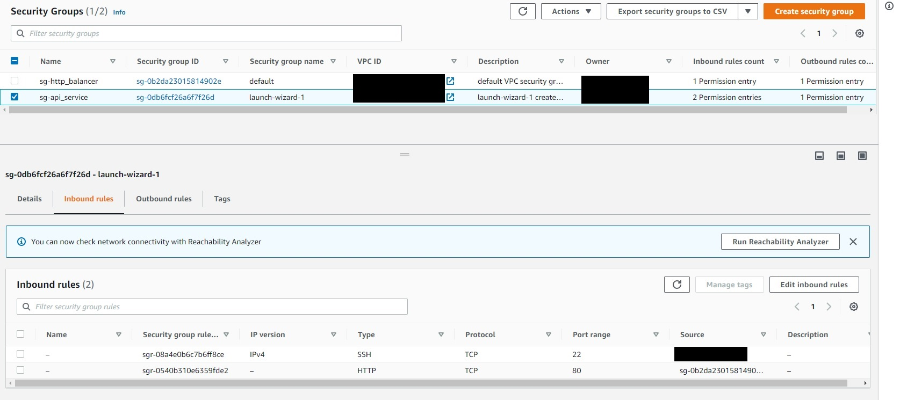
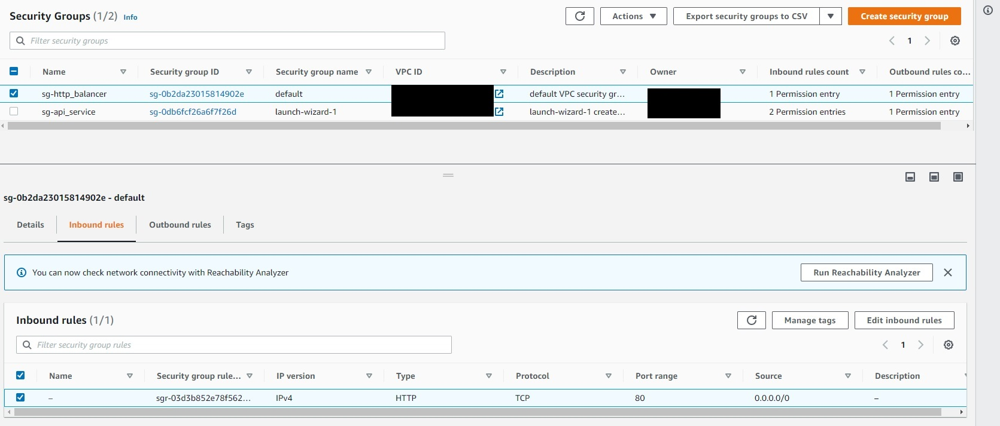
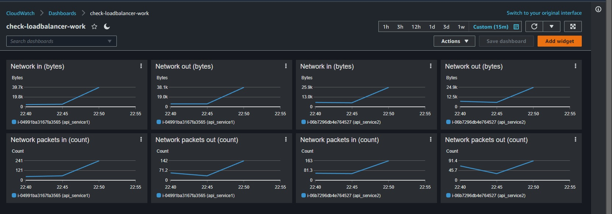
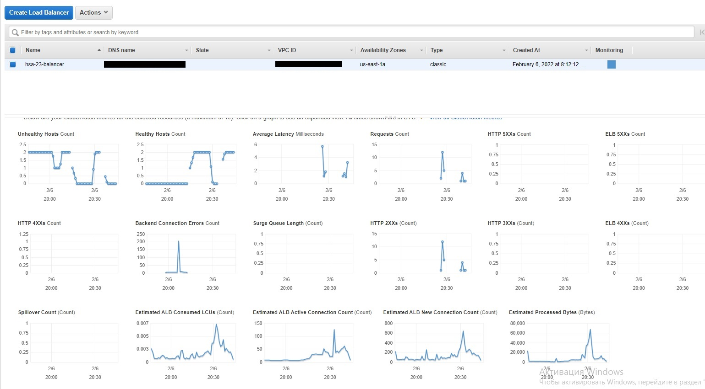

1. setup 2 instance of EC2 (AWS)  
1.1. install docker  
1.2. push image with asp.net core api  
1.3. run docker container with asp.net core api  
  

2. setup classic load balancer  



  

3. setup 2 security group (AWS)  

  

4. run siege test  
5. check monitoring (AWS)  

  

For check load balancer work:  
```
siege -c60 -t60S http://{dns_domain_load_balancer}/api/health/healthy 
```
